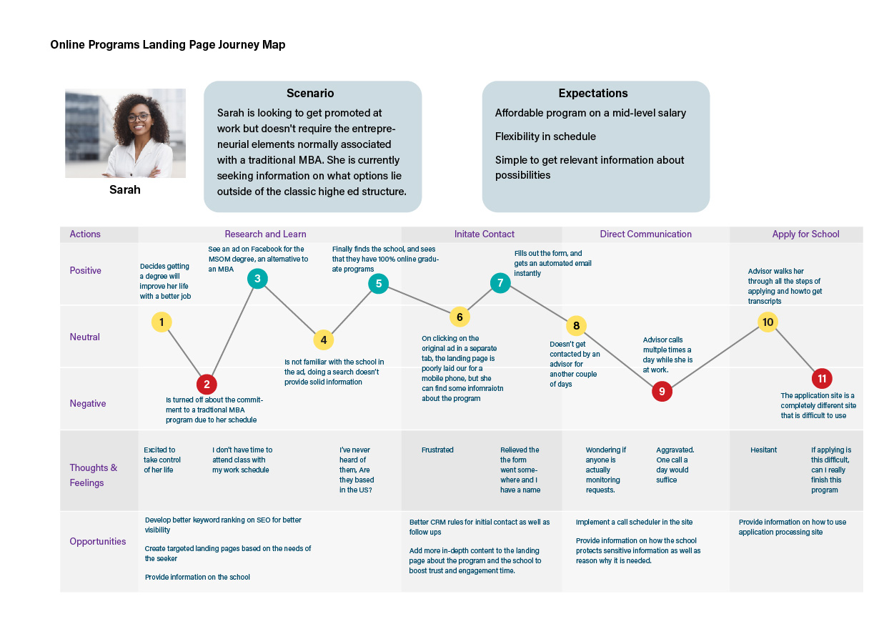
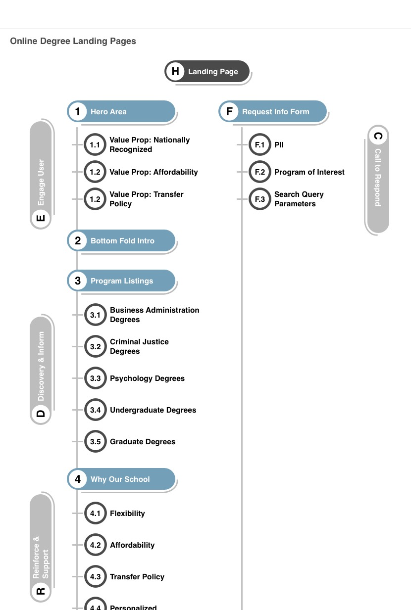
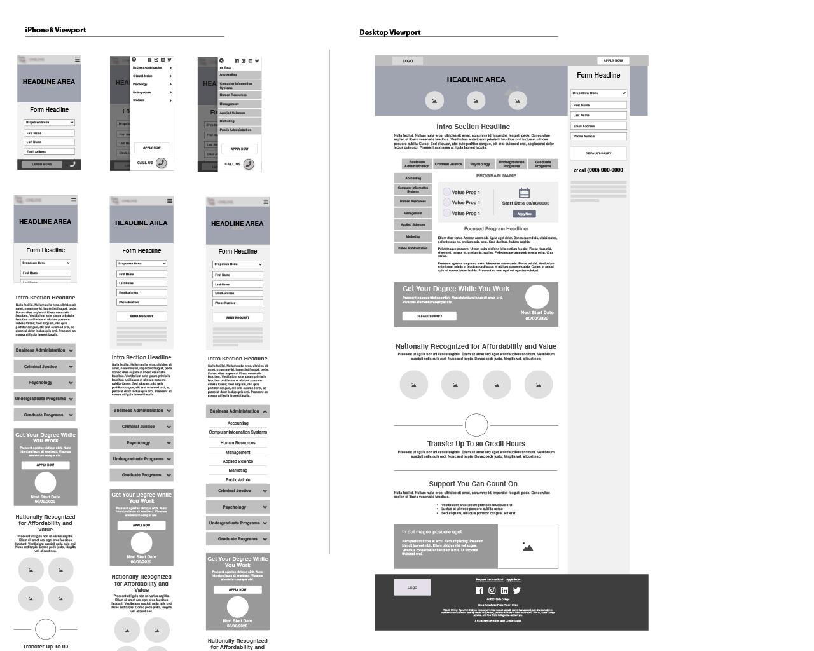

<section id="challenge">

## The Challenge

Our partnership with Peru State was to raise brand awareness of their online degree programs, with the outcome of growing enrollments into the online programs. The school had very general information pages to which ad traffic was directed, and they were experiencing a high bounce rate for visitors to the page.

</section>
<section id="overview">

## Project Overview

Our team partnered with the client to create a suite of landing pages utilizing the existing university brand to motivate online degree seekers to submit a request for more information on the program offerings. This was a tiered approach, with a general branded landing page that would display information on all the available online programs, a set of pages that would focus on the programs for the two levels of degrees (Undergraduate and Graduate), and then focused pages for each program.

Since the university's brand was not widely recognized, our challenge was to instill trust in the quality of education offered, the affordability and flexibility of the education, and the social proof that a degree from the institution would be recognized in the industry. Prior to the discovery, part of our strategy was to plan out multivariate tests at regular intervals to evolve the content and visuals, as users’ expectations tend to change in a 5-8 month cycle.

</section>
<section id="project-team" className="tags">

## Project Team
    - User Experience
    - Creative
    - Paid Search Marketing
    - Admission Advisors
    - Audience Intelligence
    - Web Development
    - Web Analytics

    </section>

<section id="journeymap">

## Journey Map

The university had the challenge of attracting degree-seeking students to their online programs due to a lack of brand awareness and a thin online marketing strategy. We worked with the school to understand more deeply the types of learners that typically attend their on-campus programs, as well as researching the current trends in psychographic and demographic audiences who enroll in online higher education programs.

Direct user interviews were set up based on the personas derived from the data to understand what a typical process of searching for an online degree for a Bachelors in Accounting, a Masters in Education, and a Masters in Organizational Management. These steps and user feedback were captured and visualized in a journey map to discover the areas we would need to focus on to remove friction for the prospective student.

</section>
<section id="architecture">

## Information Architecture

The nature of the landing page system was the initial gateway a user would only see a targeted page through an ad campaign, and the requirement was that there would not be any cross or interlinking between pages, nor any linking to a parent site. This was established to focus the user on the primary task: Fill out and submit the request for more information.

This action would enter the user into the admissions nurturing program where consistent and regular contact would be made with the interested user through personalized digital experiences to further inform and engage the prospective student, email drip campaigns to keep the prospect engaged with key admission and enrollment dates, and direct phone calls from assigned admission and enrollment advisor.

</section>
<section id="wireframes">

## Wireframes

Focusing on the areas of opportunity identified in the journey maps, aligning with the business requirements, and using the content strategy outlines for each page, I utilized user experience patterns and principles to build a flow that would highlight the key actions the user would take on a given page. The wireframes would be used in lo-fi usability testing to ensure we were getting expected behaviors, as well as discover any new barriers to the user completing the task.

</section>
<section id="conclusion">

## Conclusion

Our teams produced 15 unique landing pages to suit the needs of paid search marketing as well as persona-driven social media campaigns. These pages delivered a range of content from full overviews of all programs, targeted programs, as well as contexts such as community college transfers and non-traditional degree seekers.

The launch of the landing pages has exceeded the proposed conversion of visitor-to-lead and of lead-to-applicant. The traffic to these pages is solely dependent on paid search ads on social media outlets, which are optimized to reduce ad spend per lead and target education seekers. With the worldwide pandemic moving many traditional students into less traditional online learning, we saw an initial spike in enrollments into this school's online programs. Adjusting for the post-2020 spike, these landing pages continue to generate a moderate number of qualified leads for the managed online programs of this school.

Our teams regularly test new content and layouts based on findings from the analytics and qualitative data channels to keep engaged with our prospective students and walk with them as they look to improve their lives through higher education.

</section>