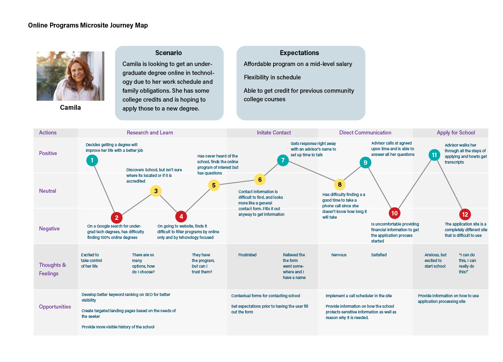
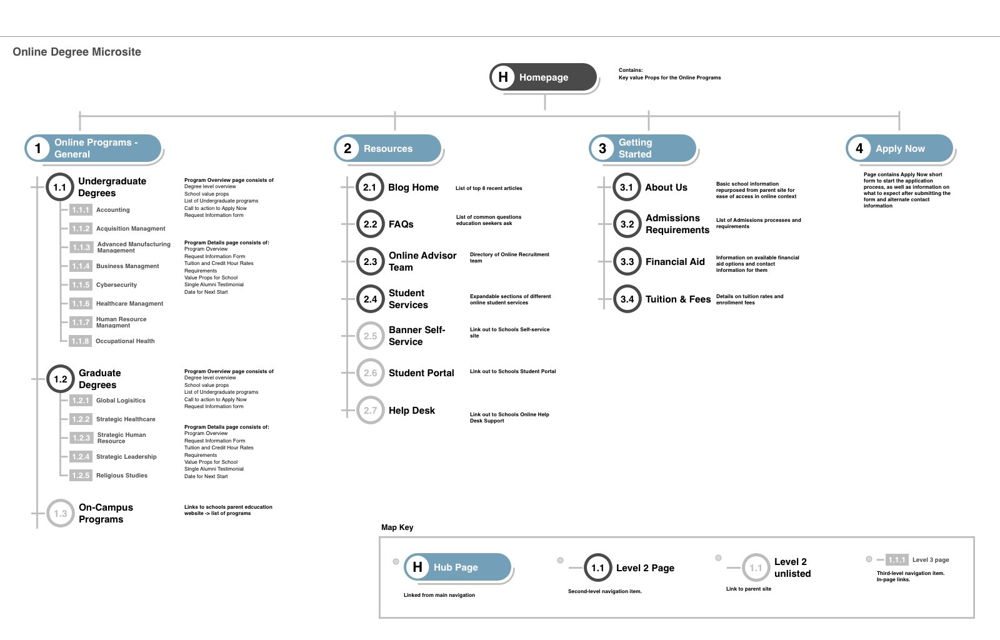
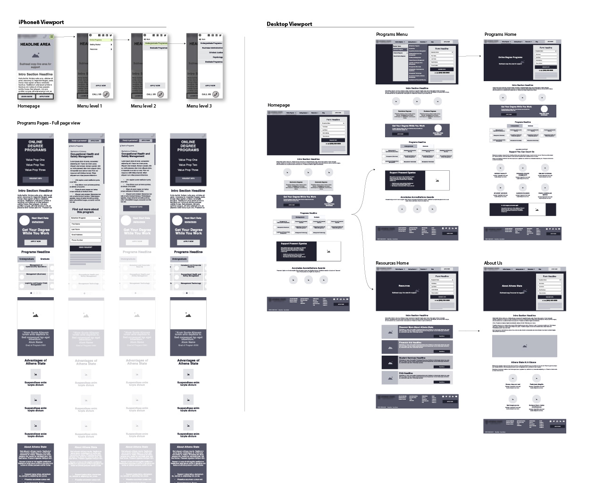

<section id="challenge">
## The Challenge

Athens State had expanded their online program offerings, but getting viable prospects for enrollment was lagging behind capacity. Due to limited institutional resources, this university hired our team to audit their marketing-to-application process and implement strategies to increase applications for the five segments of enrollment.

</section>
<section id="overview">

## Project Overview

Our team was engaged to create an optimized microsite and a suite of landing pages utilizing the existing university brand to motivate online degree seekers to submit a request for more information on a subset of program offerings. This submission would begin a journey for the seeker through our nurturing, enrollment, and retention programs that had been created to assist degree-seeking users through their discovery and enrollment stages.

Key to the success of this project would be a content-rich website for the user to engage with to gather information on the program of interest, as well as to craft the site in a way that would rank high on organic searches based on program keywords. The new site had to look as close to the parent site as possible in order to avoid too much dissonance and erosion of confidence if the two sites looked to be from different sources.

</section>
<section id="project-team" className="tags">

## Project Team

    - User Experience
    - Creative
    - SEO
    - Paid Search Marketing
    - Admission Advisors
    - Audience Intelligence
    - Web Development
    - Web Analytics

</section>

<section id="journeymap">

## Journey Map

To gain a better understanding of the challenges the client faced with enrollments in their online degree programs, we utilized the personas developed by the audience intelligence team to recruit and interview possible users that aligned with these personas. The interview asked a variety of questions based on the type of activities they would do if they would be seeking online degree programs.

From these findings, I developed user journey maps to identify areas of negative response as areas we could focus our new web properties efforts to mitigate the seeker's barriers to submitting an application.

</section>
<section id="architecture">

## Information Architecture

The microsite has an unbalanced structure due to the section for the programs having a deeply nested information architecture, while the supporting top-level sections were flat in structure. We had to collaborate closely with the SEO team in order to align an architecture that would provide saliency and discoverability for the user as well as present structured data in a manner that would gain positive search engine ranking value.

A secondary challenge was that a number of the online programs were to be managed by the university. This meant we had to link back to the parent site on some of the programs, and link to our site on others. To the user, there needed to be as little visual difference between the two types of programs.

</section>
<section id="wireframes">

## Wireframes

Focusing on the areas of opportunity identified in the journey maps, aligning with the business requirements, and using the content strategy outlines for each page, I utilized user experience patterns and principles to build a flow that would highlight the key actions the user would take on a given page. The wireframes would be used in low-fidelity usability testing to ensure we were getting expected behaviors, as well as discover any new barriers to the user completing the task.

</section>
<section id="conclusion">

## Conclusion

Our final deliverable was a microsite that existed outside of the main brand site, but still kept much of the functionality and design to make any transition between the two as seamless as possible. This would also include a blog focused on online degree content to help the site gain SEO value beyond the brand value it was already benefitting from.

With the launch of the microsite in the summer of 2021 and the coordinated online marketing efforts to drive new organic and paid search traffic to the site, the client saw a 20% increase in enrollments into a few of the programs that were struggling to attract attention, primarily in their graduate management degree programs.

Currently, the website is going through a phase 2 refresh utilizing the findings from the initial 6 months to evolve and improve content and site structure.

</section>