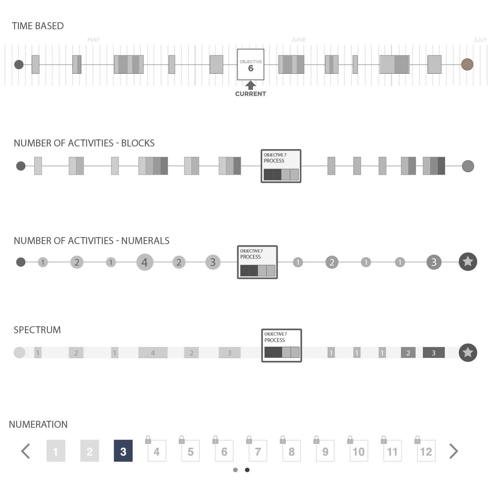
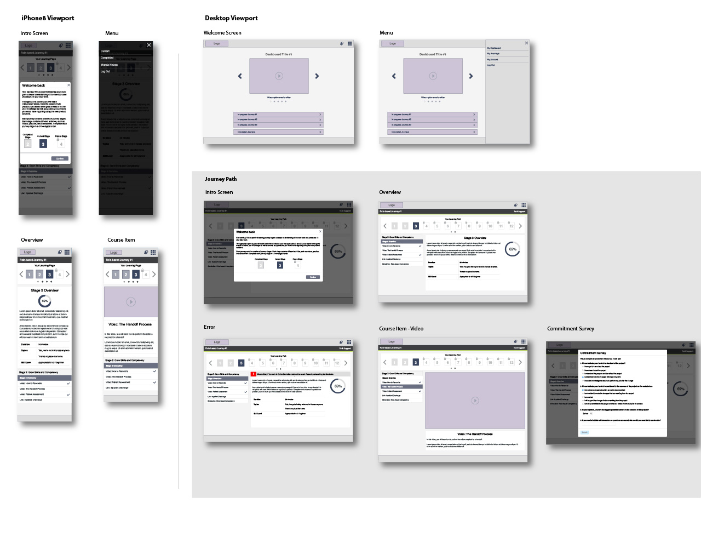

<section id="challenge">

## The Challenge

Build a platform that utilized sound organization change management principles and proven learning and acceptance techniques to instill confidence in the new EMR processes and bolster adoption of the new digital record process across a healthcare organization’s medical providers.

</section>
<section id="overview">

## Project Overview
Beginning in 2014, the healthcare industry faced a seismic change to how patient data was to be documented and shared. Through the Affordable Care Act, and its “meaningful use” mandate, healthcare providers had to put aside their familiar paper charts and instead found a computer screen between their patients and themselves. The Electronic Medical Record (EMR) came to be the primary way to record and share patient data.

Many of the practicing medical professionals had decades of experience in the industry, so introducing an entirely new way of documenting, ordering, and scheduling was met with a fair amount of resistance. Adoption was slow and steeped in contention.

Based on initial interviews, there was a consensus that none of the roles in a particular medical facility had time for in-person training with their current workload demands. Training would have to be “just-in-time” and online to allow the greatest degree of flexibility.

To provide effective online education, our online learning team at Cerner Corporation developed the concept of “journeys”: targeted, scaling learning on key topics that would not only build competency but confidence as well. These journeys would be managed within a modified learning management platform that allowed combining several relevant online courses into a meaningful journey that had a discreet beginning and end.

</section>
<section id="project-team" className="tags">

## Project Team

    - User Experience
    - Business Strategy
    - Learning Design
    - Partnership Management
    - Clinical Leadership
    - Engineering
    - Data Architecture

</section>
<section id="user-testing">

## User Testing
A key element for a journey was the visualization of the path. Through research, we devised multiple possibilities with concern for expressing time, complexity, scale, and stages. These were taken into user testing in a rough prototype to discover which brought forth positive reactions, and which put an undue burden or anxiety on the learner.

The findings from these tests concluded that our learners felt more overwhelmed when presented a visualization that described the scale of a stage or the time needed to complete it, whereas we found more neutral or positive response when the stages were handled as numerated “steps” with simple indications of what was completed, what was current and what was locked until another stage was completed.

</section>
<section id="planning">

## Content Management Planning

The platform to run these journeys was key. It had to have tools more advanced than many of the learning management systems currently available, as well as provide robust data collection and reporting to the client’s executives and our own learning designers.

Building a journey was complex.

It required a specific set of content types at each stage that would build from the previous stage and set up the next stage so that the user was progressing incrementally in their learning throughout the journey. Due to the scope of the manager platform, our team began work on this before the user-facing application.

After gathering and anlyzing the business and technical requirements, our team of strategists and UX designers developed low-fidelity prototypes and flows to define how to manage this large amount of content and data. We utilized an atomic design approach, working from the smallest chunk of content and building out to the full journey.

The approach was successful as it informed the process of our engineers as well so that as they were dedicating sprints to build the smaller blocks, our team could be defining and testing that next level up.

</section>
<section id="wireframes">

## User Wireframes
Once our UX team had reviewed and analyzed the findings from the user tests, we started to build the wireframes for a sample journey. Due to timing on the project, and to keep pace with engineering, we went from low-fidelity to medium-fidelity rather quickly in order to get into usability testing with enough time to iterate before engineering was ready to start their initial builds.

These wireframes would be added by our design system that had many of the interface elements already defined. This kept the need to create new interactive elements to a minimum and allowed a speedy transition from accepted design to initial development build.

</section>
<section id="conclusion">

## Conclusion
Our initial build of the manager and user journey sites was launched in a beta phase with a key corporate partner. Working closely with them on journey development, deployment, and reporting, we saw a marked improvement in adoption and competency in the workforce when compared to the same information presented as in-person training the year before.

Allowing the user to engage in their learning in a “start small, grow big”, as well as to be able to take part in self-directed learning at any time of the day empowered many learners, and from this, we saw many grow into learning leaders at the facility.

</section>